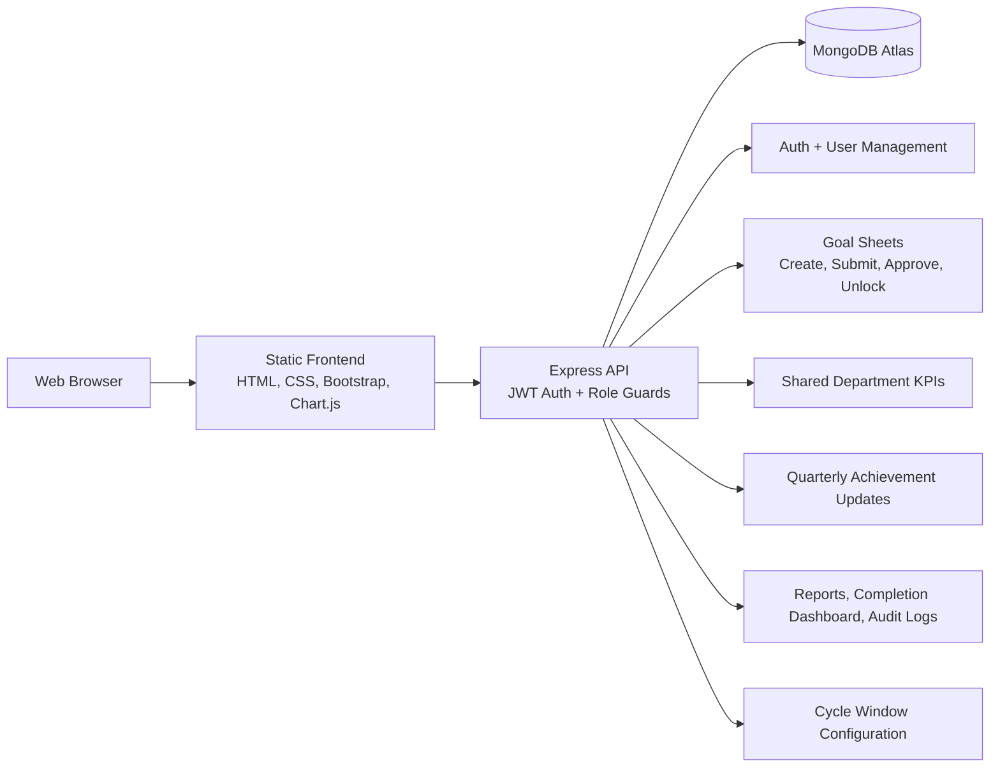

# Goal Tracker Architecture

## Hosting Choice

- Frontend: static web hosting or any low-cost object/static host.
- Backend: Node.js Express service.
- Database: MongoDB Atlas, already configured through `Backend/.env`.
- Cost control: static frontend, single API service, and one document database keep infrastructure small for the hackathon demo.
